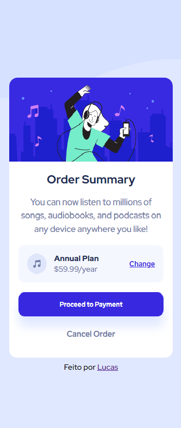

# Order Summary Card - Desafio Frontendmentor.io

## 📄 Sobre

### Esse é um exercício da plataforma [Frontend Mentor](https://www.frontendmentor.io/) sobre um cartão Order Summary. Não aprendi alguma ferramenta em específico, porém serviu para treinar e tentar melhorar a responsividade.

## 💻 Tecnologias Usadas

- HTML
- CSS

## :camera: Screenshots

## 	:desktop_computer: DESKTOP

## 	:mobile_phone_off: MOBILE

## ✔ Desafio

### Aqui você pode acessar o desafio e tentar fazer:

- https://www.frontendmentor.io/challenges/order-summary-component-QlPmajDUj/hub/order-summary-component-TrwRrrhSwt
